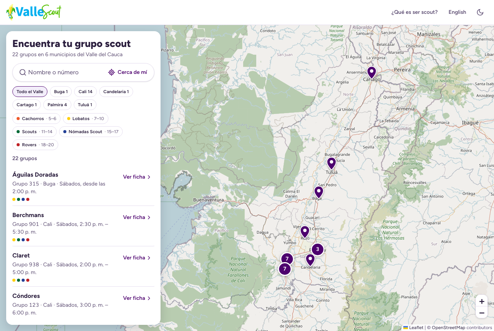

# Buscador de Grupos Scout · Región Valle

[](https://github.com/joseuribeh98/scout-groups-finder/actions/workflows/ci.yml)

Encuentra el grupo scout más cercano en el Valle del Cauca (Colombia), mira cuándo se reúne y contáctalo.

**→ [buscador.vallescout.org.co](https://buscador.vallescout.org.co)**



## Qué hace

- Búsqueda por nombre, número, municipio o dirección, sin importar tildes.
- Filtros por municipio y por rama (Cachorros, Lobatos, Scouts, Nómadas Scout, Rovers), con edades oficiales.
- "Cerca de mí": ordena los grupos por distancia.
- Mapa con agrupación de pines, sincronizado con la lista.
- Una ficha con enlace propio por grupo, con WhatsApp, correo, cómo llegar y redes.
- En español e inglés, con tema claro y oscuro, probado con axe (WCAG 2.2 AA). La lista de grupos y las fichas se generan en el servidor y se leen sin JavaScript; búsqueda, filtros y mapa lo requieren.

## Stack

[Astro](https://astro.build) (salida estática) · [Preact](https://preactjs.com) (una isla para el buscador) · TypeScript estricto · Tailwind CSS 4 · Leaflet + OpenStreetMap · Zod · Vitest · Playwright + axe · Vercel.

Decisiones de diseño: [`docs/superpowers/specs/2026-10-07-buscador-refactor-design.md`](docs/superpowers/specs/2026-10-07-buscador-refactor-design.md).

## Desarrollo

Requiere Node 22.12 o superior.

```bash
npm install
npm run dev          # http://localhost:4321
npm test             # tests unitarios
npm run test:e2e     # tests end-to-end (instala antes: npx playwright install chromium)
npm run build        # sitio estático en dist/
```

## Actualizar la información de un grupo

Todos los datos están en [`src/data/grupos.json`](src/data/grupos.json). Edita, haz commit y push: CI valida los datos y Vercel publica. Guía paso a paso: [`docs/actualizar-grupos.md`](docs/actualizar-grupos.md).

Por privacidad, el sitio solo publica canales institucionales (correos `@scout.org.co`), redes del grupo y números de WhatsApp autorizados por cada grupo. El esquema rechaza cualquier otro campo.

## English

Scout group finder for the Valle del Cauca region of the Scouts of Colombia Association. Static Astro site with a single Preact island, bilingual (ES/EN), tested with axe (WCAG 2.2 AA), with validated data and no personal information. See the sections above for commands; group data lives in `src/data/grupos.json`.

## Licencia

Código bajo licencia [MIT](LICENSE). Los nombres, logos y emblemas de Scouts de Colombia y de la Región Valle pertenecen a sus titulares.
